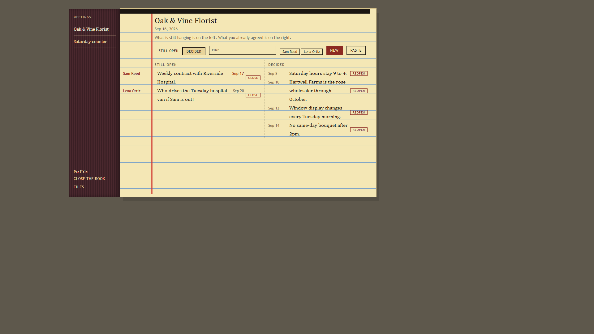
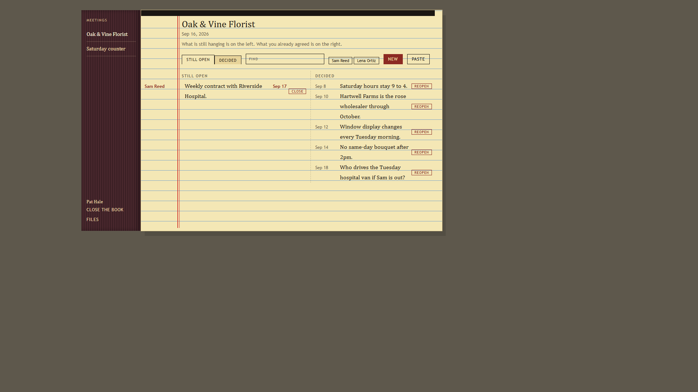
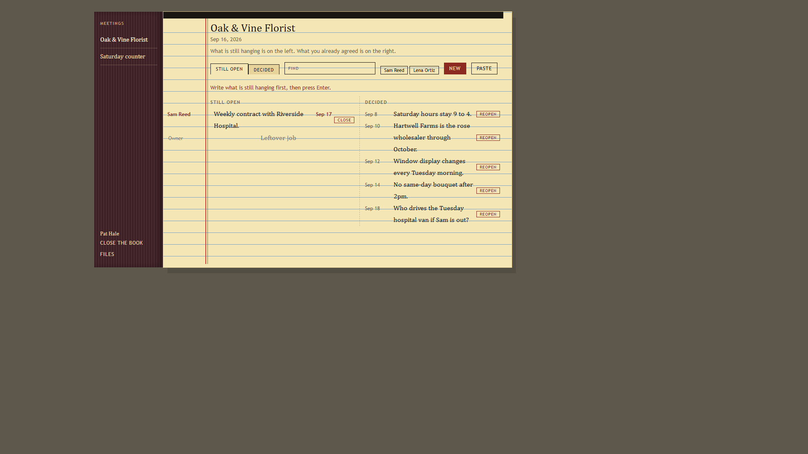

# Decided

Decided is a notebook for what happened in a meeting.

A lot of meetings end with a long email or a pile of notes, and by
next week nobody is sure what was actually agreed and what is
still hanging. This tool is for writing that down in one place.

You keep two kinds of lines. The left page is still open: a
leftover job or an unanswered question, with the name of the
person who still has it. The right page is decided: a call the
group already made, so you do not have to argue it again.

You can type a new line yourself, or paste a dump from an email
and keep the lines that matter.

## Who it is for

A shop or crew that already runs React and keeps losing what was
agreed in a long email. They want one place that says what is
still open and what they already decided.

## What you get

Copy `src/lib/`. That folder is the notebook.

- `Log.jsx` - the pad: still open, decided, write on the line
- `Book.jsx` - cloth spine and yellow pad
- `DecisionPage.jsx` - open one leftover or one call
- `PasteBox.jsx` - paste an email, keep the lines
- `decided.css` - the look
- `decided-json.js` - load, save, old files still open
- `sample-decisions.js` - Oak & Vine Florist sample
- `index.js` - the import

There is no account. Host apps pass `value` and `onChange`. The
demo keeps the notebook in this browser. Load the florist sample
again if you want Oak & Vine back. Older files with
`{ title, decisions }` still open as one meeting.

Still open sits on the left. Decided sits on the right. Close
moves a leftover to the decided page. Reopen brings it back.
Meetings sit as tabs on the cloth spine. Find matches a leftover
job or a name. Paste splits on blank lines or sentences. A blank
leftover miss tells you to write it first. Escape cancels. Quiet
Remove with undo. Print the pages. j and k move, n starts a new
line, / finds, c closes, Enter opens a line.

## Run the demo

```
npm install
npm start
```

Open http://127.0.0.1:48531/

The demo starts on a closed cover. Write your name so it shows on
the spine. It stays in this browser, and it is not an account.
Then open the Oak & Vine florist sample, or start a blank
notebook. How to use it is linked from the cover.

Hosted copy: https://aaronlb912.github.io/decided/

Files: https://github.com/Aaronlb912/decided

## Demo







https://github.com/user-attachments/assets/d6ef70e1-8f0d-41b2-883e-01e034f92a1a

Repo copy: [docs/media/decided-demo.mp4](docs/media/decided-demo.mp4)

Voice is Microsoft Andrew Neural. Music is Wallpaper by Kevin MacLeod (incompetech.com), CC BY 3.0.

## Use it in your own React app

1. Copy the `src/lib/` folder into your project (for example
   `src/lib/`).
2. Import the notebook and pass it in.

```jsx
import { useState } from 'react'
import { Log, sampleBook } from './lib/index.js'

export function Meetings() {
  const [book, setBook] = useState(sampleBook)
  return <Log value={book} onChange={setBook} />
}
```

Change the title and the meetings. Edit `src/lib/decided.css` if
you want a different look. The cover pages stay in this repo.
They are not in `src/lib/`.

`value` is a notebook: `title` and `logs`. A meeting has `id`,
`title`, `meetingOn`, `note`, and `decisions`. A line has `id`,
`what`, `when`, `who`, `stillOpen`, `owner`, `followUp`,
`thread`, `notes`, and `closedOn`. One meeting still looks like
`{ title, decisions }`. Pass `onChange` when the notebook
changes. Optional: `onCover`, `deskName`, `onResetSample`.
